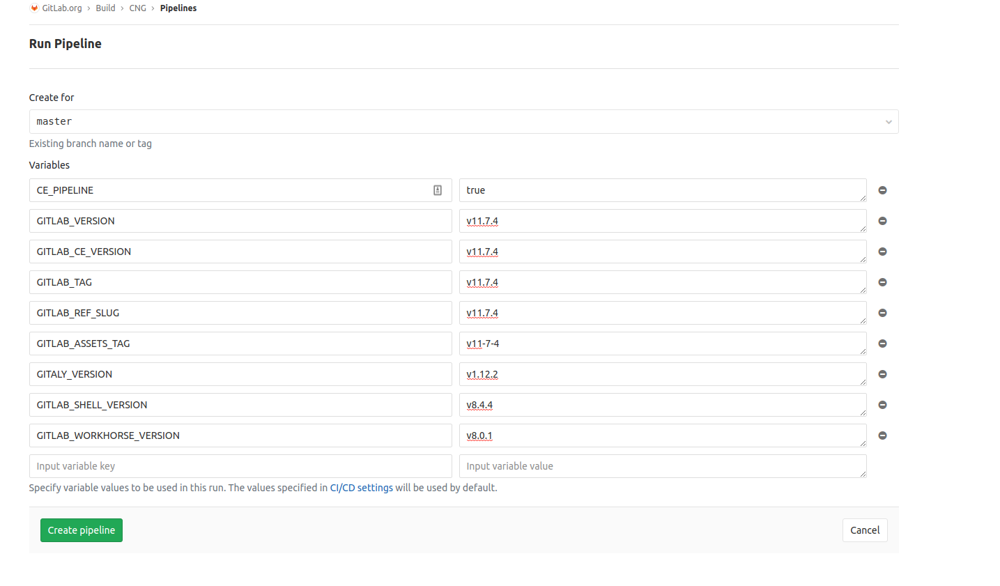
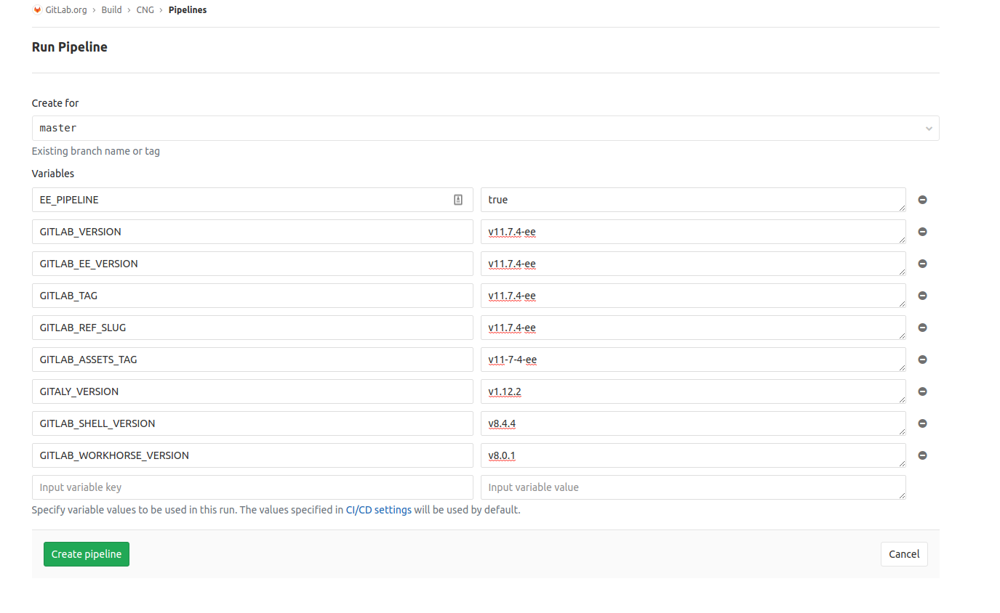

# Building Images

Building these images is done through GitLab CI. By default triggering a CI build will use the latest upstream gitlab master,
and build both gitlab-ce and gitlab-ee versions.

For tagging specific versions of GitLab as part of our regular automated release process, the CI pipeline is triggered from the gitla-ce and gitlab-ee repos when tagged, and those repos pass
along the ref information to inform this project what GitLab versions to build.

## Manually triggering the pipeline for a reference

If manual run of the pipeline needs to be done in order to build/rebuild a particular ref of GitLab,
the build needs to be triggered in this repo's GitLab project with the following variables:

- `GITLAB_VERSION` - The GitLab ref name used to download the source code. For tags it should be the tag name.
- `GITLAB_ASSETS_TAG` - This is used for fetching the js/css assets, and must be the slug version of the *GITLAB_VERSION*
- `GITLAB_TAG` - Only provided when the GitLab version is a tagged version. When set this is the tag name.
- `GITLAB_REF_SLUG` - This is used as the docker label when the new images are built. For tags, this is the tag name. For branches, this is typically the slug version of the branch.
- `GITALY_SERVER_VERSION` - The version of gitaly to build. This needs to be a tag reference that matches what is in the *GITALY_SERVER_VERSION* file in the version of GitLab being built.
- `GITLAB_SHELL_VERSION` - The version of gitlab-shell to build. This needs to be a tag reference that matches what is in the *GITLAB_SHELL_VERSION* file in the version of GitLab being built.
- `GITLAB_WORKHORSE_VERSION` - The version of workhorse to build. This needs to be a tag reference that matches what is in the *GITLAB_WORKHORSE_VERSION* file in the version of GitLab being built.

**For CE:**

The following variable should be present for a CE build:

- `CE_PIPELINE` - set to `true`

**For EE:**

The following variable should be present for a EE build:

- `EE_PIPELINE` - set to `true`

